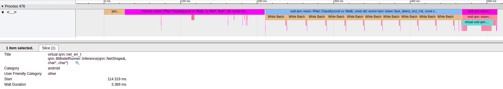

# Systrace

## Coding

Example 1:

```
void function() {
  const char *name = "blablabla";
  Tracer::TraceBegin(name);
  // Profiling codes
  Tracer::TraceEnd();
}
```

Example 2:

```
void function() {
  const char *name = "blablabla";
  ScopedTrace t(name);
  // Profiling codes
}
```

or you can use ``__PRETTY_FUNCTION__`` instead.

```
void function() {
  ScopedTrace t(__PRETTY_FUNCTION__);
  // Profiling codes
}
```

## Profiling

Systrace python script can be found in Android Studio. You can start a profiling by the following command:

### On PC

```
    python systrace.py --target=linux -o results.html
```

### On SOC

On soc is a bit tricky since bm1880 doesn't have ADB. First copy ``scripts/trace.sh`` to bm1880, then follow the instructions below.

```
# Open SSH terminal 1
cp <mount folder dir>/trace.sh /data/
cd /data
chmod +x trace.sh
./trace.sh <trace filename>.dat

#Open SSH terminal 2
./<your program>
```

Exit profling anytime by pressing ``CTRL+C`` in terminal 1.

On PC, download [Catapult](https://github.com/catapult-project/catapult/tree/master/) from Github and use the following command to translate trace logs to html.

```
catapult/tracing/bin/trace2html ~/path/to/trace.dat
```

Use Chrome to open the html.



See [systrace](https://developer.android.com/studio/command-line/systrace), [ftrace](https://source.android.com/devices/tech/debug/ftrace) for more info.
